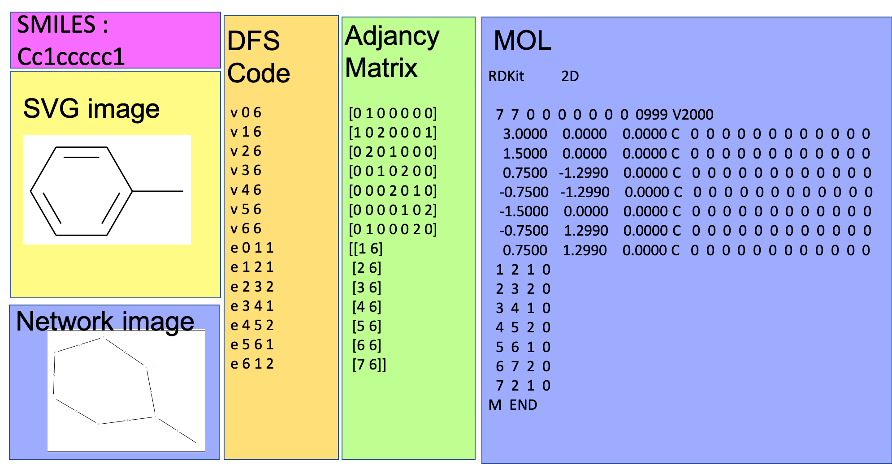
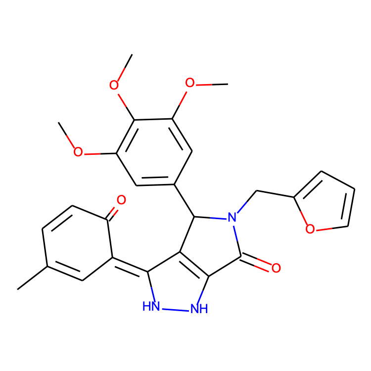

Chemo Graph Convert utils
====

python modules for chemical data visualization, and converter. This program convert under matrix expression each other.
<div align="center">
    
</div>


## Description
- Convert frequently using data structures in chemo infomatics to each other.
- It visualizes the molecular structure as an SVG image.
    - Wrapping the rdkit's functions
- It draw an arbitrary labeled connected graph as a network graph.
    - wrapping the networkx functions
- The author's specialty is computer science, so I don't know much about chemoinformatics.
- In the realm of chemoinfomatics, It is possible that my code sometimes process inaccurately for input data. 
- Supported data structure are follows
    - [SMILES](https://ja.wikipedia.org/wiki/SMILES%E8%A8%98%E6%B3%95)
    - [MOL](http://www.metabolomics.jp/wiki/Aritalab:Lecture/Compchem/MOL)
    - DFS Code (Depth first search code)
    - adjacency Matrix
- Unsupported symbols of SMILES are follows,
    - "@"
    - "."
    - ">"
    - more than 100 vertex in molcule data


## Requirement

- [rdkit](https://www.rdkit.org/)
- [networkx](https://networkx.github.io/documentation/stable/tutorial.html)
- numpy
- matplotlib


# Demo 

### smiles -> adjacency

1. experimental setting is writtern in demodb/ 
    - demoDB/smiles : put smiles format input file in this directory
    - file name : NUM.txt 
        - ex) 1.txt 
2. test_1_smiles2adjacency.py 

```
usage: test_1_smiles2adjacency.py [-h] id

convert smiles format 2 adjacency matrix

positional arguments:
  id          data_id
```

3. demo 

```
$ cd ./src
$ python3 test_1_smiles2adjacency.py 1
```

4. output
- standard output
    - SMILES format
    - MOL format
    - adjacency matrix, and vertex labels


### adjacency matrix -> DFS Code 
1. experimental setting is writtern in demodb/ 
    - demoDB/smiles : put smiles format input file in this directory
    - file name : NUM.txt 
        - ex) 1.txt 
2. test_2_adjacency2dfs.py 

```
usage: test_2_adjacency2dfs.py [-h] id out_path

convert adjacency matrix to DFS Code

positional arguments:
  id          data_id
  out_path    output dir. default is ../out/dfscode
```

3. demo 

```
$ cd ./src
$ python3 test_2_adjacency2dfs.py 1
```

4. output
- default, dfs code will be output in out/dfscode/dfs.txt

### network draw
1. experimental setting is writtern in demodb/dfscode 
    - file name : dfs.txt

```
usage: test_3_network.py [-h] pic_num

draw network picture

positional arguments:
  pic_num     number of network pictures.
```
2. demo
```
$ python3 test_3_network.py 10 
```

3. output
- out/dfs2pic

#### supplement
This implementation will be output a specified number of network picture. The placement issue of Vertex and edge is NP-hard. If you want to get nice picture, please set big number as "pic_num" args.

### DFS Code -> MOL
1. experimental setting is writtern in demodb/ 
    - demoDB/smiles : put smiles format input file in this directory
    - file name : NUM.txt 
        - ex) 1.txt 
2. test_4_dfs2mol.py 

```
usage: test_4_dfs2mol.py [-h] id out_path

convert adjacency matrix to DFS Code

positional arguments:
  id          data_id
```

3. demo 

```
$ cd ./src
$ python3 test_4_dfs2mol.py 1
```

4. output
- standard output : MOL format 

#### supliment
This demo code convert from smiles format in this flows. 
**smiles => MOL => adjacency matrix => DFS Code => MOL**
I want to show you that this code can convert from original DFS Code to MOL format.


### MOL => SVG 
. experimental setting is writtern in demodb/ 
    - demoDB/smiles : put smiles format input file in this directory
    - file name : NUM.txt 
        - ex) 1.txt 
2. test_5_mol2svg.py 

```
usage: test_5_mol2svg.py [-h] id out_path

convert adjacency matrix to DFS Code

positional arguments:
  id          data_id
```

3. demo 

```
$ cd ./src
$ python3 test_5_mol2svg.py 1
```

4. output
- svg image at /out/svg/test.svg 
<div align="center">
    
</div>

## DFS Code 
DFS Code can expresses a connected labeled graph.

```
v 0 3
v 1 8
v 2 3
e 0 1 1
e 1 2 1
```

- v arg1 arg2
    - vertex information
        - arg1 : vertex id
        - arg2 : vertex label. 
- e arg1 arg2 arg3
    - edge information
        - arg1 : from vertex id 
        - arg2 : to vertex id 
        - arg3 : edge label


## Author
[hanekichi++](https://github.com/se-z)
